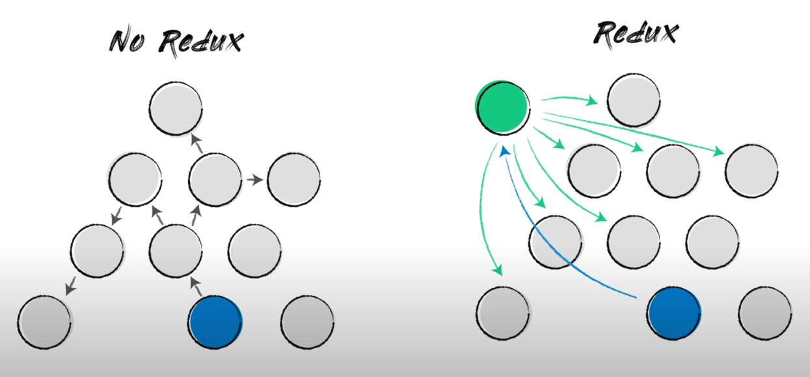
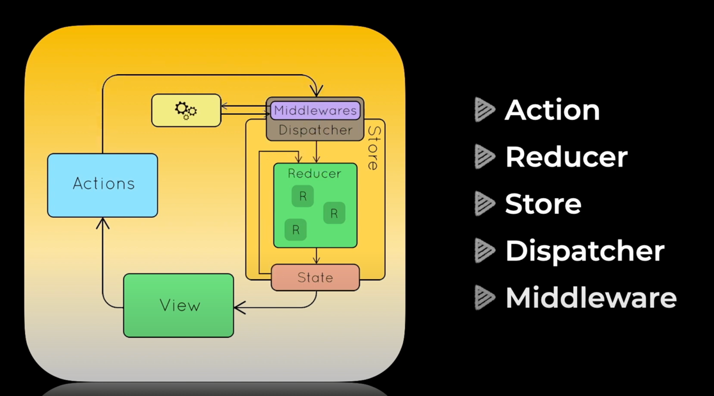
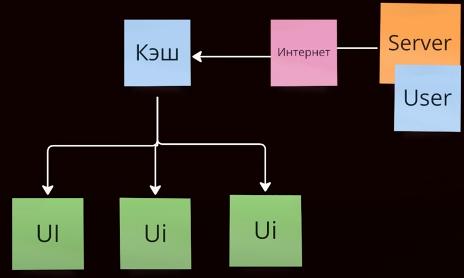

# Full-stack приложение "Список желаний"

- [**Стек**](#stack)
- [**Структура проекта (много важных пояснений по файлам)**](#project_files)
- [**Теоретическая сводка**](#theory)
- [**Доступные скрипты**](#scripts)

<a name="stack"></a>
## Стек

Фронтенд стек:  
[typescript](https://www.typescriptlang.org/) + [react](https://reactjs.org/) + [redux](https://redux.js.org/) + [saga](https://redux-saga.js.org/) + [react-router](https://reactrouter.com/) + [sass](https://sass-lang.com/) + [webpack](https://webpack.js.org/)

Бекенд стек:  
[python](https://www.python.org/about/) + [fastapi](https://fastapi.tiangolo.com/) + [postgresql](https://www.postgresql.org/)

<a name="theory"></a>
## Теоретическая сводка

Данный раздел необходим для разъяснения технологий, используемых в приложении.\
Здесь будет описан процесс написания приложения

**Создание index.tsx**\
Это точка входа в приложение.\
Здесь выполняется инициализация самого React-приложения и связывание с DOM (через createRoot).\
Основная задача: подготовить приложение к запуску и "вставить" его в корневой элемент HTML.\

Инициализация приложения происходит в функции init():
1. **createRoot** (из react-dom/client)\
   Отвечает за создание корневого узла приложения, связанного с DOM.\
   Рендерит React-компоненты внутри HTML-элемента с ID root.
2. **Provider** (из react-redux)\
   Оборачивает всё приложение, чтобы дать доступ к Redux Store.\
   Позволяет компонентам через хуки (useSelector, useDispatch) взаимодействовать с глобальным состоянием.
3. **store**\
   Хранилище состояния приложения, созданное в Redux.\
   Используется для управления глобальными данными, которые могут быть общими для многих компонентов (например, авторизация пользователя, настройки, корзина покупок).

Здесь необходимо пояснить, как работает Redux.
### Redux
**Redux** — это библиотека для управления глобальным состоянием приложения. Она упрощает обмен данными между компонентами.\
Принцип его действия строится на том, чтобы состояние компоненты выносить во внешнюю зависимость и любая другая компонента получала актуальное состояние уже из этой внешней зависимости



Основные элементы Redux:
1. **Store**\
   Хранилище, где лежит всё состояние приложения.\
   Это единый объект, доступный для всех компонентов. На рисунке выше этот объект обозначен зеленым цветом
2. **Action**\
   Действие, описывающее, что нужно сделать.
   Это простой объект с типом (type) и данными (payload). Другими словами actions определяют, как мы можем изменять данные
3. **Reducer**\
   Функция, которая принимает текущее состояние и Action, а возвращает новое состояние.
   Решает, как изменить Store на основе Action. Сам Reduser напрямую изменяет состояние
4. **Dispatch**\
   Способ отправить Action в Store, чтобы Reducer обновил состояние.\
   То есть Dispatch это некий диспетчер, который отправляет сообщения (actions) Reduser'у. 
5. **Provider**\
   Обёртка, которая делает Store доступным всем компонентам в приложении через контекст.

Как всё работает вместе?
1. Пользователь выполняет действие (например, нажимает кнопку). 
2. Вызывается dispatch, который отправляет Action.
3. Reducer получает текущее состояние и Action, создаёт новое состояние.
4. Store обновляет глобальное состояние.
5. Компоненты, подписанные на Store, автоматически обновляются.

В src/index.tsx приложение App оборачивается в Provider, который принимает store в качестве props.
```typescript jsx
root.render(
        <Provider store={store}>
           <App/>
        </Provider>
);
```
В свою очередь store настраивается в src/store/index.ts

Очевидно, что в крупном приложении недостаточно иметь один Reducer.\
Для решения данной проблемы создают combineReducers
```typescript
const rootReducer = combineReducers({
   modals: modalsReducer,
   ui: uiReducer,
   user: userReducer,
   alertList: alertListReducer
});

export const setupStore = (preloadedState?: Partial<RootState>) => {
   const sagaMiddleware = createSagaMiddleware();

   const isDevelopment = process.env.NODE_ENV === 'development';

   const store = configureStore({
      reducer: rootReducer,
      devTools: isDevelopment,
      middleware: getDefaultMiddleware =>
              getDefaultMiddleware({thunk: false, serializableCheck: false}).concat(sagaMiddleware),
      preloadedState
   });

   sagaMiddleware.run(sagas);

   return store;
};

const store = setupStore();
```
`rootReducer` собираем все reducers приложения в один корневой.\
`combineReducers` объединяет все редьюсеры в один главный редьюсер rootReducer, который управляет состоянием приложения.\
`configureStore` создает Redux-хранилище.\
`rootReducer` передается в configureStore, чтобы указать, как управлять состоянием.\
`preloadedState` опциональное начальное состояние для всех Reducers, если preloadedState не передан, используется состояние, заданное в каждом редьюсере через initialState
`sagaMiddleware` Способ расширения Redux дополнительным функционалом через Redux-Saga

### Redux-Saga
В момент создания хранилища (Store) настраиваются Middleware, которые расширяют функционал Redux.\
Одним из таких Middleware является Redux-Saga.

#### Архитектура Redux выглядит следующим образом:

Если наше приложение работает синхронно, то архитектура Redux выглядит довольно просто.\
Мы создаем reducer, который описывает, как изменяется состояние приложения в ответ на действия (actions).\
Затем инициализируем store, который является центральным хранилищем состояния.\
Для управления состоянием используем actions, которые передаются через dispatcher, чтобы модифицировать данные в store.

Компоненты приложения подписываются на изменения store и автоматически обновляются, когда состояние изменяется.\
Таким образом, при изменении состояния, подписанные компоненты рендерятся заново, чтобы отобразить актуальные данные.

Однако, если в приложении требуется работа с асинхронным кодом (например, запросы к API, таймеры или сторонние сервисы), процесс становится более сложным.\
Асинхронные действия не могут быть выполнены напрямую в reducers, так как reducers должны быть чистыми функциями и работать синхронно.\
Это создает проблему: мы должны дождаться выполнения асинхронного действия, обработать результат (например, данные API или ошибку) и затем обновить store.

Как решается проблема асинхронности в Redux?\
Для управления асинхронным кодом в Redux есть несколько подходов. Самые популярные из них: Redux Thunk и Redux Saga

#### Как работает Redux Saga?
Redux Saga подключается к Redux через middleware и действует как менеджер побочных эффектов (side effects):

Когда в store отправляется (dispatch) действие, сага перехватывает его.\
Сага выполняет указанную логику, например:
* Делает API-запрос с помощью эффекта call,
* Обновляет состояние через put (диспатч действия),
* Ждет выполнения других эффектов (delay, takeEvery, takeLatest).

Результат работы саги (успех или ошибка) передается обратно в Redux.

В Redux-Saga есть три основных сущности:
* Saga Watcher (следит за actions, когда происходит выполнение actions, то выполняется действие)
* Saga Worker (процесс, который будет запускаться в зависимости от выполненного action, здесь описывается бизнес-логика приложения)
* Effects (вспомогательная функция, которая создает объекты, внутри которых описаны инструкции выполнения каких-то действий, действия будут выполняться внутри Саги. Встроено в библиотеку)

#### Как работать с Redux-Saga?
1. Определить watcher saga\
Вотчеры следят за действиями (actions), которые отправляются в store.\
Используются эффекты, такие как takeEvery или takeLatest, чтобы подписаться на конкретные действия.
2. Создать worker saga\
Воркер выполняет основную асинхронную логику (например, API-запросы) и диспатчит новые действия в зависимости от результата.
3. Работа с эффектами\
Эффекты (call, put, take, delay, select и др.) используются для управления потоком саг.
4. Организовать rootSaga\
RootSaga объединяет все watcher saga, чтобы они могли работать одновременно.

### Axios

Для выполнения http-запросов существует встроенный в браузер API, называемый fetch.\
Пример fetch запроса:
```js
fetch('https://api.example.com/data')
  .then(response => response.json())
  .then(data => console.log(data))
  .catch(error => console.error('Ошибка:', error));
```
Основные неудобства связанные с fetch заключаются в следующем:
1. Нет обработки ошибок для HTTP-статусов. fetch считает запрос успешным, если сервер ответил, даже если код ответа — ошибка (например, 404 или 500), из-за этого нужно вручную проверять response.ok
2. Ограниченные возможности настройки, например, нет таймаутов из "коробки"
3. Нет интерцепторов, нельзя централизованно перехватывать запросы или ответы (например, для добавления токенов)
4. Сложность в запросах с сериализацией данных. Например, для отправки JSON нужно вручную добавлять заголовки и сериализовать данные

Axios - это библиотека решающая часть неудобств fetch, она также основа на Promise
Основные ее преимущества:
1. Автоматически обрабатывает JSON-ответы без необходимости вызывать response.json()
```js
axios.get('https://api.example.com/data').then(response => {
   console.log(response.data); // Данные уже распарсены
});
```
2. Axios автоматически выбрасывает исключение для HTTP-статусов ошибок (например, 404, 500), а не только для сетевых ошибок
```js
axios.get('https://api.example.com/data')
  .catch(error => {
    console.error(error.response.status); // HTTP-статус
  });
```
3. Поддержка интерцепторов. Можно централизованно добавлять логику перед каждым запросом или ответом (например, токены авторизации или логи ошибок)
```js
axios.interceptors.request.use(config => {
   config.headers.Authorization = `Bearer ${token}`;
   return config;
});
```
4. Удобная работа с конфигурацией. Базовые настройки (например, baseURL, заголовки) задаются один раз. И так далее...

#### Настройка Axios

Для конфигурации axios создан файл apiService.ts\
Класс ApiService используется для выполнения HTTP запросов, инкапсулирует логику создания запросов и обработки ответов.

В конструкторе класса конфигурируется axios:  
Устанавливаются стандартные заголовки;  
Устанавливается стандартный перехватчик ответов для получения только чистых данных без мета-информации в роде заголовков;  
Принимает параметр baseURL, который будет использоваться в качестве базового URL для всех запросов.

Методы для HTTP запросов: Каждый метод (get, post, patch, put, delete) выполняет соответствующий HTTP запрос и возвращает результат в формате ApiResponse, который включает:
 - data: данные ответа от сервера
 - headers: заголовки ответа
 - status: статус код HTTP
 - statusText: текстовое описание статуса

Пример использования в requests/wishList.ts:
```typescript
import wishlist from 'api/services/wishList';

wishlist.get<ResponseType>('/path/to/resource');
```
Такая структура была принята на случай, если потребуется подключение к внешним сервисам.  
В таком случае достаточно будет добавить в `src/api/services` новый сервис, к которому нужно будет подключиться, а затем использовать его в `src/api/requests/...`

В файле `src/api/services/wishList.ts` настроено использование переменных окружения для выбора правильного базового URL API в зависимости от текущего окружения (продакшн или локальное).

### React-Query

TanStack Query или React Query: Асинхронный state-менеджер\
Что такое state-менеджер?\
Обычный state-менеджер (например, Redux) подключается к приложению и позволяет управлять состоянием приложения, вынося сложную логику из компонентов.

Алгоритм работы синхронного state-менеджера:

1. UI диспатчит (dispatch) определенные события.
2. На основании этих событий изменяется модель (state).
3. Компоненты реагируют на изменения state, и UI перерисовывается.

Эта логика является синхронной и отлично подходит для обработки сложной интерактивности, как в приложениях вроде Miro, Todoist или Google Docs.\
В таких проектах чаще всего используется Redux или другие синхронные state-менеджеры.

Почему нужен асинхронный state-менеджер?\
При взаимодействии с сервером в алгоритм работы добавляется еще одно звено — интернет, через который проходят запросы. Чтобы минимизировать количество запросов, используется кеширование.



Асинхронные задачи с кешем часто однотипны, например:

- Отслеживание состояния запросов.
- Повторные попытки (ретраи).
- Обработка ошибок.
- Очистка кеша и "мусора".
- Дедупликация запросов (один запрос из нескольких компонентов).

С этими задачами лучше всего справляются асинхронные state-менеджеры (например, RTK Query, React Query, Apollo и другие).

Ключевые особенности:\
Асинхронный state-менеджер не заменяет синхронный, а решает другие задачи.

Важно использовать оба типа в зависимости от потребностей приложения:
* Синхронный — для управления состоянием внутри приложения.
* Асинхронный — для работы с данными, полученными с сервера.

#### Настройка React-Query

1. Инициализация [QueryClient](https://tanstack.com/query/latest/docs/reference/QueryClient)
   QueryClient является центральным объектом React Query.
   В нем хранятся все запросы, кеши и прочие данные.

2. Создание провайдера
   Для доступа к QueryClient в компонентах необходимо:
* Создать провайдер (QueryClientProvider), который оборачивает все приложение.
* Передать инициализированный клиент как пропс провайдеру.

После этого хуки React Query получают доступ к QueryClient:
* useQuery — для выполнения запросов.
* useMutation — для изменения данных.

Структура настройки:
1. Инициализация QueryClient\
Файл: `src/api/client.ts`

```typescript
const queryClient = new QueryClient({
   queryCache: new QueryCache({
      onError: _error => {
         const error = _error as unknown as DefaultError;

         store.dispatch(addErrorAlert(getErrorMessage(error)));
      }
   }),
   mutationCache: new MutationCache({
      onError: _error => {
         const error = _error as unknown as DefaultError;

         store.dispatch(addErrorAlert(getErrorMessage(error)));
      }
   }),
   defaultOptions: {
      queries: {
         staleTime: 10 * 60 * 1000,
         retry: false,
         refetchOnMount: true,
         refetchOnWindowFocus: false
      }
   }
});

export default queryClient;
```

2. Создание провайдера\
Файл: `src/api/ReactQueryProvider.tsx`

```typescript jsx
interface Props {
   children: React.ReactNode;
}

const ReactQueryProvider: React.FC<Props> = ({children}) => (
        <QueryClientProvider client={queryClient}>
           <ReactQueryDevtools initialIsOpen={false} buttonPosition="bottom-left"/>
           {children}
        </QueryClientProvider>
);

export default ReactQueryProvider;
```

3. Оборачивание приложения провайдером\
Файл: `src/index.tsx`
```typescript jsx
function init() {
   const container = document.querySelector('#root');

   if (container) {
      const root = createRoot(container);

      root.render(
              <Provider store={store}>
                 <ReactQueryProvider>
                    <App/>
                 </ReactQueryProvider>
              </Provider>
      );
   } else {
      throw Error('Target container is not a DOM element.');
   }
}

init();
```

Теперь приложение готово для работы с React Query.  
Можно использовать хуки useQuery и useMutation для запросов и мутаций.

### React-Router

#### Зачем нужен роутинг?
В веб-приложениях часто требуется отображать разные страницы или разделы в зависимости от действий пользователя.  
Например, переход по ссылкам, открытие профиля, или отображение страницы с ошибкой 404.

Без роутинга для изменения страниц пришлось бы перезагружать приложение полностью, что неэффективно
и плохо сказывается на пользовательском опыте.

React-Router — это библиотека, которая управляет навигацией внутри React-приложения без перезагрузки страницы. 

Она позволяет:

* Создавать маршруты (routes) для различных страниц.
* Подключать компоненты к соответствующим маршрутам.
* Отображать разные компоненты в зависимости от пути (URL).
* С React-Router приложение становится одностраничным (SPA - single page application), а маршрутизация обрабатывается 
на стороне клиента.

#### Настройка React-Router
1. Создание маршрутов (routes)\
Для настройки маршрутов создается массив объектов RouteObject. Каждый маршрут описывает:

- path: путь в URL.
- element: компонент, который отображается на этом пути.
- children: дочерние маршруты (вложенные пути).

2. Инициализация роутера\
React-Router предоставляет функцию createBrowserRouter для создания роутера на основе заданной конфигурации.

3. Оборачивание приложения роутером\
Созданный роутер подключается к приложению через компонент RouterProvider.

#### Структура настройки:

1. Конфигурация маршрутов\
Файл `src/routesConfig.tsx`
```typescript jsx
// Конфигурация маршрутов
const routes: RouteObject[] = [
   {
      element: <Layout/>, // Общий layout для всех страниц
      children: [
         {
            path: PATH.MAIN, // Главная страница
            element: <Main/>
         },
         {
            path: PATH.NOT_FOUND, // Страница 404
            element: <NotFound/>
         }
         // Пример защищенного маршрута:
         // {
         //   path: '/',
         //   element: <ProtectedRoute />,
         //   children: protectedRoutes // Вложенные защищенные маршруты
         // }
      ]
   }
];
```

2. Оборачивание приложения провайдером роутера
Файл: `src/App.tsx`
```typescript jsx
function App() {
   return (
           <RouterProvider router={routesConfig}/>
   );
}
```

На этом роутинг настроен, в дальнейшнем необходимо производить подключение новых роутов по мере их появления

### Стилизация с использованием Sass

### Webpack

<a name="scripts"></a>
## Доступные скрипты

Склонировав репозиторий и находясь в корне проекта, вам доступны команды:

### `npm run dev`

Запускает приложение в режиме разработки, а именно запускает Webpack Dev Server, 
который позволяет просматривать и тестировать приложение в реальном времени в браузере.  
Этот сервер автоматически пересобирает проект, когда в исходный код внесли изменения, обновляет страницу без необходимости вручную перезагружать ее.\
Откройте [http://localhost:3000](http://localhost:3000) для просмотра в браузере.